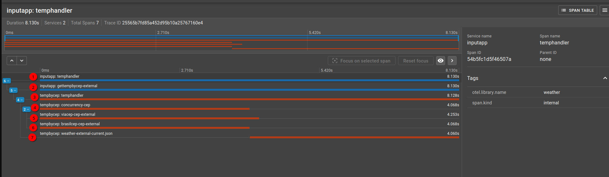

# Executar
- executar algum dos executaveis ou via go run tempByCep.go
- Enviar alguma request para localhost:8080/temp/"cepCode"
- O retorno aparecerá no console e também na resposta.

# Executar com docker-compose
```shell
docker-compose up --build -d
```

para testar enviar uma request http para o servidor A e olhar o trace no zipkin
http://localhost:9411/zipkin/


## Serviço A  -> Receber o CEP e validar string -> InputApp
porta 8091

```curl
curl --location 'http://localhost:8091' \
--header 'Content-Type: application/json' \
--data '{
    "cep": "25900028"
}'
```

## Serviço B  -> Temperatura Por CEP -> tempByCep
porta 8090
```curl
curl --location 'http://localhost:8090/temp/20541155'
```

## Guia dos Traces


1. Handler/Controller que recebe a request no Serviço A
2. Request feita do Serviço A para o Serviço B
3. Handler que recebe a request no Serviço B
4. Grupo de Requests Concorrentes com go routines feitas pelo Serviço B
5. Request externa Via CEP
6.  Request externa Via Brasil CEP (VENCEDORA NESTA FOTO)
7. Request externa com o CEP retornado por uma das APIS para pegar a temperatura na WheaterAPI
